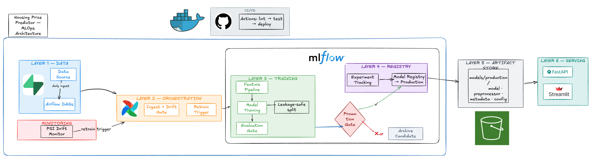

[](https://github.com/HaDo1802/housing_price_predictor/actions/workflows/ml_pipeline_ci.yml)

# Housing Price Predictor: End-to-End MLOps Project 




- Streamlit UI: [`vegas-housing-price-predictor`](https://vegas-house-price-predict.streamlit.app/)


Transforming the classic **beginner house price prediction** problem into a **production-grade machine learning project** that implements practical MLOps patterns across the entire lifecycle:
- config-oriented management using config.ymal 
- modular data + feature pipelines
- reproducible training and evaluation
- experiment tracking and model governance with MLflow
- conditional promotion to production
- FastAPI for local/backend development and Streamlit for deployment
- drift checks (PSI-based)
- CI quality gates

## Airflow Orchestration

The Airflow layer is now split into three focused DAGs:

- `data_ingestion_dag`
  - scheduled `@daily` (can be adjusted to weekly when the dataset is large enough )
  - ingests the latest dataset from Supabase
  - runs drift checks
  - triggers candidate training only when retraining is needed
- `train_candidate_dag`
  - is triggered by `data_ingestion_dag`
  - runs tracked training and pushes the MLflow `run_id` and `test_r2`
- `promote_candidate_dag`
  - is triggered by `train_candidate_dag`
  - evaluates the candidate against Production, promotes if it wins, then syncs the production snapshot to local files and S3

Why split this into three DAGs:

- ingestion, training, and promotion are different operational concerns
- each DAG stays shorter and easier for development and debug

### DAG: Data Ingestion + Drift Gate


This is the only scheduled DAG in the system. It runs daily, checks whether drift is meaningful enough to justify retraining, and only then triggers the next DAG.

### DAG: Candidate Training


This DAG is event-driven. It starts only when ingestion decides retraining is needed, then logs a candidate run to MLflow and forwards the run metadata downstream.

### DAG: Promotion + Production Sync


It compares the candidate against the current Production model, promotes only when the metric gate passes, and then publishes the new production artifact snapshot.


## Project Goals

This repository is designed as a learning + portfolio project to show how an ML model can move from notebook experimentation into a maintainable production workflow, focusing on the MLOps design rather than optimizing the model accuracy (which is limited size of the current live data)

Core goals:

- Turn a one-off notebook workflow into a repeatable training system.
- Learn how to track runs, configs, metrics, and lineage instead of guessing what changed.
- Practice promotion decisions through explicit quality gates, not manual intuition.
- Separate training, registry, artifact delivery, and serving so each part is easier to debug.
- Build a serving workflow that depends on a stable production snapshot, not the training environment.
- Add orchestration and drift checks so retraining can be triggered by signals, not by habit.

Why this is worth learning instead of stopping at a regular data science notebook:

- A notebook can train a model once. An MLOps system can train it the same way every time.
- A notebook shows one result. An MLOps system keeps history, lineage, and promotion decisions.
- A notebook mixes everything together. An MLOps system separates training, deployment, and serving.
- A notebook gives you a model file. An MLOps system gives you a governed production artifact.
- A notebook rarely answers “what is in production and why?” An MLOps system is built for that.

## Why This Architecture

The codebase is intentionally separated by responsibility:

- `src/predictor/`: core ML package logic (reusable + testable).
- `scripts/`: operational entrypoints for jobs (train, promote, sync artifacts).
- `serving/`: online inference layer (FastAPI + Streamlit).
- `conf/`: single-file configuration in `conf/config.yaml`.
- `tests/`: unit + integration tests to protect behavior.

This structure scales better than notebook-centric projects because each concern evolves independently:

- model logic changes do not require API rewrites
- deployment/runtime changes do not require training rewrites
- config changes do not require code edits

## MLOps Practices Implemented

### 1) Single-File Configuration

Implemented in [config.py](src/predictor/config.py) with a single YAML source:

- `conf/config.yaml`

Why this pattern matters:

- keeps training configuration explicit and easy to audit, we only changes in 1 place for hundreds different experiemental runs


### 2) Experiment Tracking and Registry Governance

Implemented in:

- [training_pipeline.py](src/predictor/training_pipeline.py)
- [registry.py](src/predictor/registry.py)

Tracked in MLflow:

- parameters, metrics, tags, model artifact, feature metadata, config snapshots
- model version tags including git commit and model type

Why this pattern matters:

- you can answer "what model is in production and where did it come from?"
- supports rollback/debugging and lineage traceability


### 3) Artifact Strategy for Serving Reliability

Implemented in [sync_production_artifacts.py](scripts/sync_production_artifacts.py), [artifact_store.py](src/predictor/artifact_store.py), and [predict.py](src/predictor/predict.py):

- sync the current Production model into a stable artifact snapshot
- publish the production snapshot to S3
- production inference loads from the S3 production snapshot
- explicit local artifact loading is kept only for tests and local debugging

Why this pattern matters:

- keeps serving decoupled from MLflow runtime availability
- gives Streamlit and future APIs one stable production artifact source

### 4) Post-Deployment Drift Monitoring

Implemented in:

- [drift.py](src/predictor/drift.py)

Current monitoring includes:

- PSI drift checks against a reference snapshot

Why this pattern matters:

- shifts project from pure training to lifecycle monitoring
- creates a path toward retraining triggers and model observability

### 5) CI Quality Gates

Implemented in [ml_pipeline_ci.yml](.github/workflows/ml_pipeline_ci.yml):

- formatting check (`black --check`)
- linting (`flake8`)
- tests (`pytest`)

Why this pattern matters:

- enforces consistent standards before merge
- catches integration errors early (e.g., missing tracked modules/imports)


## Repository Structure

```text
.
├── conf/                        # Single YAML configuration
├── data/                        # Raw, processed, sample, and feedback datasets
├── docker/                      # Dockerfiles + compose setup
├── image/                       # Cover image and media assets
├── notebooks/                   # Exploration and experimentation notebooks
├── scripts/                     # CLI/job scripts (train, promote, sync artifacts)
├── serving/                     # FastAPI service + Streamlit app
├── src/predictor/               # Core ML package
├── tests/                       # Unit + integration tests
├── Makefile
├── pyproject.toml
├── requirements.txt
└── README.md
```

## Quick Start

### 1) Install Dependencies

```bash
python -m pip install --upgrade pip
python -m pip install -r requirements.txt
python -m pip install -e .
```

### 2) Run Quality Checks

```bash
make format
make lint
make test
```

### 3) Train Model Pipeline

```bash
python scripts/train.py
```

### 4) Inspect MLflow

```bash
mlflow ui
```

Open `http://localhost:5000`.

### 5) Serve FastAPI

```bash
make api
```

FastAPI is kept for local development and future integrations. With the current production inference setup, make sure these environment variables are available before starting the API:

```bash
export ARTIFACT_BUCKET=your-bucket-name
export AWS_ACCESS_KEY_ID=...
export AWS_SECRET_ACCESS_KEY=...
export AWS_DEFAULT_REGION=us-west-1
```

### 6) Run Streamlit UI

```bash
make ui
```

This is the primary deployed interface. Streamlit also expects the same S3 artifact environment variables when running against the production model snapshot.

## Pipeline Scripts

- Train pipeline:

```bash
python scripts/train.py
```

- Promote model / sync production artifacts:

```bash
python scripts/promote.py --model-name housing_price_predictor --version 1 --stage Production
python scripts/sync_production_artifacts.py
```

- Drift check utility:

```bash
python -m predictor.drift
```

## API Endpoints

Base URL local: `http://localhost:8000`

- `GET /health`
- `GET /model/info`
- `POST /predict`
- `POST /predict/batch`
- `POST /predict/file`

Swagger docs: `http://localhost:8000/docs`

## Docker Deployment

```bash
docker compose -f docker/docker-compose.yml up --build
```

Services:

- FastAPI on `8000`
- Streamlit on `8501`

`models/production` is mounted read-only into containers for local artifact workflows. The primary production serving path loads from the S3 production snapshot.

## Testing Strategy

Tests currently include:

- training-to-inference contract checks
- unit tests for config loading
- unit tests for data cleaning and training-column selection
- unit tests for preprocessor fit/transform behavior
- unit tests for registry governance
- unit tests for production artifact sync
- unit tests for regression metric outputs

Run:

```bash
python -m pytest tests -v
```

## Scaling and Future Evolution

The current design already supports several scaling directions:

- More models:
  Add new estimators in the trainer registry without changing serving contract.
- More environments:
  Use config layering to separate local/CI/prod data paths and settings.
- Stronger governance:
  Extend promotion gates with multiple metrics and safety checks.
- Better observability:
  Push feedback/drift metrics to a dashboard or alerting stack.
- Safer deployments:
  Add canary/staging traffic split using model stage transitions.

## Learning Outcomes Demonstrated

This project demonstrates practical skills in:

- ML system design and modular architecture
- reproducible training pipelines
- experiment tracking and model registry workflows
- model promotion governance using metric thresholds
- production API and UI integration
- monitoring-aware ML lifecycle design
- CI/CD quality automation
- containerized deployment patterns

## Author

Ha Do
- Email: havando1802@gmail.com
